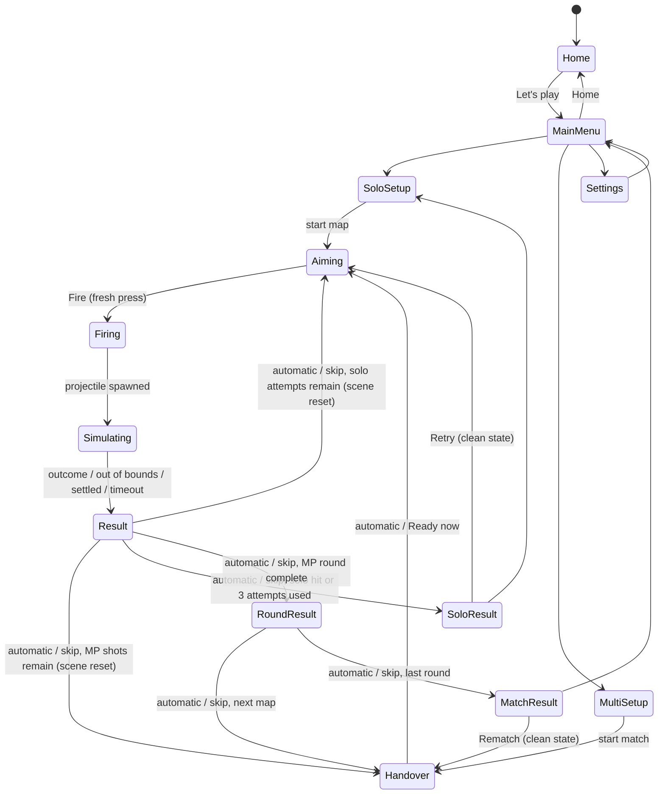

# Hit Jonh — Implementation Specification

**Status:** Authoritative implementation specification, v0.2 (4 October 2026)
**Source:** Derived from `hit-jonh-game-design.md` (design brief v0.1). Where they disagree, this file wins; record any change in `docs/progress.md`.
**Spelling:** The character and game are **Jonh** / **Hit Jonh**. Never "John".

### How to read the labels

| Label | Meaning |
| --- | --- |
| **[DECIDED]** | Fixed by the design brief or by an explicit request from the project owner. |
| **[PROPOSED]** | A default chosen to unblock implementation. **Not approved by the owner.** Change freely after playtesting. |
| **[ASSUMPTION]** | Something believed true that must be verified during the named milestone. |
| **[TUNE]** | A numeric value expected to change during playtesting. Lives in `src/config/tuning.ts` or level data. |
| **[OPEN]** | Unresolved. Do not silently decide it; pick a reversible default and log it. |

---

## 1. Product concept

A humorous 2D browser game. Players adjust a cannon's **angle** and **power** to hit Jonh, an ordinary man trying to enjoy his afternoon. Flight follows consistent, believable gravity; the comedy comes from Jonh's calm, disproportionate reactions and the physical consequences. **[DECIDED]**

**Player fantasy:** make a precise shot, watch an outrageous consequence, prove you can do it in fewer attempts than your friends.

## 2. Design pillars [DECIDED]

| Pillar | Consequence for implementation |
| --- | --- |
| Learnable aiming | Identical inputs + identical scene ⇒ identical flight and outcome (within one build/browser). |
| Useful misses | Show the previous trail and landing point; keep the last settings. |
| Physical comedy | Humour lives in reactions, props, sound — never in altering the shot. |
| Fair local competition | Same launch position, same shot count, scene reset before every competitive shot. |
| Quick replay | Retry/rematch in one action; result screens are skippable. |
| Manageable first release | One projectile, three maps; every feature must improve the angle/power/hit loop. |

## 3. Core loop and controls

**Owner-requested usability pass (4 October 2026) [DECIDED]:** Canvas drag aiming, automatic progression after shots, clearly alternating multiplayer turns, obstacles on every map, comic hit/FAAH sounds, a home screen above the mode menu, an in-game Home action, and multiplayer map selection. These replace conflicting earlier prototype defaults below. Deferred features remain outside this pass.

### 3.1 Loop [DECIDED]

1. Read the scene → 2. Aim (angle, power) → 3. Fire (inputs frozen) → 4. Watch → 5. Resolve (classify, feedback, reaction) → 6. Continue (retry, hand over, next map).

The player must be able to tell **short**, **over**, and **obstacle hit** apart. Shot results advance automatically after a short reaction window; a Next now action can skip that wait. Terminal solo/match results stay visible for retry/rematch.

### 3.2 Controls

| Action | Pointer / touch | Keyboard [PROPOSED] |
| --- | --- | --- |
| Angle | Drag up/down anywhere on canvas, or angle slider [DECIDED] | ← / → (1° per press) |
| Power | Power slider | ↓ / ↑ (1 % per press) |
| Fire | Fire button | Space |
| Continue / hand over | Automatic after a short window; button skips wait | Enter skips the shot result |
| Pause | Pause button | Escape |

- Display angle in whole degrees and power as an integer percentage. **[DECIDED]**
- Angle range **5°–85°** above horizontal **[PROPOSED][TUNE]**. Power **0–100 %**. Every map must be solvable inside these ranges.
- Controls are **HTML elements outside the canvas** (native slider accessibility, touch, focus handling) **[PROPOSED]**.
- **Accidental-action rules [DECIDED]:**
  - Fire is accepted only in the `aiming` state.
  - Fire requires a fresh press: ignore `KeyboardEvent.repeat`, and ignore Space until it has been released at least once after entering `aiming`.
  - Gameplay shortcuts are ignored while a text input/select has focus.
- Aiming aids **[DECIDED]**: barrel shows true angle; short initial-direction guide at the muzzle; last trail + landing marker. **No full trajectory preview** in normal play.

## 4. First-release scope

### 4.1 Included [DECIDED]

- One cannonball type.
- Three maps: Jonh's Backyard (flat), The Fence Dispute (obstacle), Rooftop Lunch (elevated target).
- Solo challenges: three attempts per map.
- Local multiplayer, 2–4 players, one device, turn-based.
- Saved aiming settings, previous-shot trails, scoring, quick rematch.
- Cartoon presentation, slapstick reactions (stationary Jonh: idle + hit reactions).
- Essential sound effects, mute, reduced-motion setting.

### 4.2 Deferred (not permanent exclusions)

Online play/accounts; simultaneous firing; AI opponents; wind/drag/weather; extra ammo; articulated ragdolls; destructible terrain and chain reactions; Jonh moving during shots; upgrades/shops/economy; level editor; global leaderboards; unlimited practice mode (**optional** — only if cheap, and must never overwrite challenge results).

## 5. Solo rules

- Choose any map (all unlocked). Three attempts. **[DECIDED]**
- A valid **body hit** ends the challenge immediately as a success. **[DECIDED]**
- Hat-only hits do **not** count as success in solo **[PROPOSED]**.
- After three non-successful attempts: short failure result with immediate Retry.
- Rating **[PROPOSED]**: ★★★ hit on shot 1, ★★ on shot 2, ★ on shot 3. A qualifying ricochet body hit adds a separate "style" marker; it does not change stars.
- Best result per map stored locally (fewest shots; style marker kept if ever earned) **[PROPOSED]**.
- Scene reset before every attempt (see §7); settings and last trail persist across attempts.

## 6. Local multiplayer rules

- 2–4 players; each has a name (default "Player N", typing never required), a cannon colour **and** pattern (not colour alone), personal angle/power. **[DECIDED]**
- All players fire from the **same launch position**; inactive cannons are drawn as decorative slots outside the playfield. **[DECIDED]**
- **Map selection [DECIDED]:** Available in multiplayer setup. **Format [PROPOSED]:** Choose a single-map match (one round) or the default three-map tour, Backyard → Fence → Rooftop. Each player gets **3 shots per round**, fired in rotating order (A, B, C, A, B, C, …), not consecutively [DECIDED]. Rematch retains the chosen maps.
- Starting player rotates between rounds: round *r* (0-based) starts with player index `r mod N`. **[DECIDED principle, PROPOSED formula]**
- A round always completes every player's shots, even after an early hit. **[DECIDED]**
- **Target cycles (owner-approved 4 October 2026) [DECIDED]:** Each round has three shot cycles, one shot per player per cycle. Jonh stays at the same position for every player in that cycle and throughout each shot's result/reaction. At handover into the next cycle he relocates to a different authored position. Each map's three positions are shuffled independently without replacement at match creation and rematch; the schedule is held in match memory, never in save data. Resetting aim and pausing do not change it. Solo remains unchanged.
- Multiplayer target centres are Backyard **15, 18, 21 m**, Fence **14, 17, 20 m**, Rooftop **16, 18.5, 21 m**. Horizontal body/hat offsets and tested reference shots live in level data. Height, dimensions, obstacles, scoring and physics stay unchanged. Saved aim and personal trails persist as adjustment aids; cycle status explains that Jonh has moved. **[DECIDED]**
- A brief handover screen names the next player, then automatically opens aiming; Ready now skips the wait. Their saved settings and last trail load automatically. Scores remain visible in the control strip.
- Players **can** learn from each other's shots; this is intended. **[DECIDED]**
- Which previous trails are visible: active player's last trail in their colour **[PROPOSED]**; showing others' trails faintly is **[OPEN]**.

## 7. Scoring and scene reset

### 7.1 Shot outcomes (recorded **once** per shot)

| Outcome | Definition | MP points [PROPOSED] |
| --- | --- | ---: |
| Ricochet body hit | Body hit after the projectile contacted a surface flagged `ricochet: true` in level data during this shot | 125 total |
| Body hit | Projectile (or, later, a prop it owns) contacts Jonh's body collider | 100 |
| Hat-only hit | Contacted the hat collider, never the body | 20 |
| Miss | None of the above | 0 |

- Award only the **highest** applicable outcome. Hat-then-body ⇒ body result.
- **Ground is never ricochet-eligible.** Which surfaces are eligible is per-map data **[OPEN]** (initial proposal: fence faces and the building wall).
- No near-miss points. **[DECIDED]**
- Idempotency: the first body contact finalises scoring; later collision callbacks cannot change or repeat it. **[DECIDED]**
- Winner: highest total. Tie-break: more body hits; still tied ⇒ shared win. **[PROPOSED]** (Sudden-death tie-breaker deferred.)

### 7.2 Scene reset [DECIDED principle]

Before **every** attempt (solo and MP): remove live projectiles, restore Jonh, hat, and every prop/obstacle to level-data spawn state, clear pending timers and score events from the previous shot. Preserve: each player's angle/power, each player's last trail and landing marker, scores. The map is unchanged within a round.

**Multiplayer exception [DECIDED]:** Jonh and his nearby decorative scenery reset to the active cycle's authored position, rather than the solo spawn. The effective level is shared by rendering, Matter colliders and swept collision detection; original level data is never mutated. Position changes happen only in handover after all players complete the preceding cycle.

**Restart / rematch:** clears all live bodies, timers, pending events, and scores; keeps player names, colours and aim settings **[PROPOSED]**.

### 7.3 Persistence [PROPOSED]

`localStorage` key `hitJonh.v1` (versioned JSON; ignore and replace on parse failure): solo best per map, last solo aim per map, settings (mute, volume, reduced motion), last MP player setup.

## 8. Physics requirements

### 8.1 Units and coordinates

- Simulation maths: **metres, seconds, kilograms; +y up**. Gravity **g = 9.81 m/s²** downward. **[DECIDED]**
- Phaser/Matter world: logical pixels, **+y down**, fixed logical viewport **1280 × 560 px** **[PROPOSED][TUNE]**. The appearance improvement pass crops unused upper sky; metres, gravity, geometry, launch speed and horizontal bounds are unchanged. Flights above the viewport remain simulated and use an off-screen marker.
- Scale: **50 px per metre** **[PROPOSED][TUNE]** ⇒ visible viewport is **25.6 m × 11.2 m**. Level bounds retain 25.6 m × 14.4 m; leaving the top is allowed.
- The canvas is scaled to the container (`Phaser.Scale.FIT`). Screen size **never** affects physics. Verified at setup: logical size stays 1280×720 and Matter gravity unchanged when the viewport is 500 px wide.
- All conversions live in `src/sim/units.ts`; no inline magic conversion factors elsewhere.

**Matter.js 0.20 unit facts (verified from Phaser 4.2.1 bundled source):**
- Matter integrates with position Verlet. Gravitational acceleration in **px/ms²** = `gravity.y × gravity.scale` (default scale 0.001). Hence `gravity.y = g · ppm / 10⁶ / scale` = **0.4905** for 9.81 m/s² at 50 px/m (unit-tested).
- `Body.setVelocity` takes **px per base step** where base step = 1000/60 ms. Conversion: `v_matter = v[m/s] · ppm / 60`. Encapsulate in the physics adapter.
- Default `frictionAir` is 0.01; the cannonball **must** use `frictionAir = 0` (no drag in first release).

### 8.2 Launch model [DECIDED structure, TUNE values]

```text
p      = power% / 100                     (0..1)
J      = Jmin + p · (Jmax − Jmin)          launch impulse, N·s
v      = J / m                             launch speed, m/s
vx, vy = v·cosθ, v·sinθ
x(t)   = x0 + vx·t ;  y(t) = y0 + vy·t − ½·g·t²
```

- Proposed: m = 4 kg, Jmin = 24 N·s, Jmax = 80 N·s ⇒ v ∈ [6, 20] m/s; flat 45° range ≈ 3.7–40.8 m. **[PROPOSED][TUNE]**
- Holding Fire does not change power. Mass is constant in the first release. **[DECIDED]**
- Projectile spawns at the muzzle tip, outside the barrel collider, so it cannot hit its own cannon. **[DECIDED]**

### 8.3 Fixed-step simulation [DECIDED]

- Fixed step **1/120 s** (validate on target devices) **[TUNE]**.
- Phaser's Matter world runs with `autoUpdate: false`; the scene calls `matter.world.step(stepMs)` *n* times per frame using `FixedStepper` (`src/sim/fixedStep.ts`). Phaser 4's `MatterRunnerConfig` has no fixed-step flag — do not rely on the built-in runner.
- Max **8** steps per frame; excess backlog is discarded **[TUNE]**. On tab hidden/visible the accumulator resets (no catch-up burst).
- Optional render interpolation uses `FixedStepper.alpha`.
- Pause = stop calling `step`. Slow motion, if ever added, must still step the same fixed `dt` (scale real time fed to the accumulator, never `dt`).
- Reproducibility target: identical within one build + browser + configuration. Cross-device bit-identity is **not** assumed.
- Matter sleeping disabled during shots (`enableSleeping: false`) **[PROPOSED]**.

### 8.4 Materials [TUNE]

Per-surface `restitution` and `friction` come from a material table in tuning config, referenced by name in level data. First release uses **grass** (low bounce), **wood** (fence; solid, static), **concrete** (roof/wall; some bounce). A surface that looks the same must behave the same every attempt. Rubber and glass are deferred.

### 8.5 Shot end conditions [PROPOSED][TUNE]

A shot resolves at the first of:
1. **Valid outcome registered** — a body hit resolves scoring immediately; physics may continue briefly (≤ 1.5 s) for the comic aftermath, skippable.
2. **Out of bounds** — projectile centre with x < −1 m or x > world width + 1 m. Leaving the **top** is allowed (it may come back); show an off-screen marker.
3. **Settled** — projectile speed < 0.05 m/s for 0.5 s.
4. **Safety timeout** — 15 s of simulated time (longest legitimate flight ≈ 4 s), logged as a warning in dev.

## 9. Hit detection and fast projectiles

### 9.1 Colliders

- **Jonh body:** one simple static solid collider (rounded rectangle/capsule approximation) **[DECIDED: simple]**. The ball bounces off him physically. Cosmetic animation must stay visually aligned with it.
- **Hat:** separate **sensor** collider (ball passes through; hat flies off cosmetically). Hat contact alone never counts as a body hit. **[DECIDED]**
- After a body hit is recorded, Jonh's collider may be disabled so the authored reaction can play.
- Each collider carries data tags: `role` (`jonhBody`, `jonhHat`, `ground`, `obstacle`), `material`, `ricochet: boolean`.

### 9.2 Fast-projectile requirements

Matter.js has **no continuous collision detection**; a fast body can tunnel through thin geometry between steps. Required mitigations, all of them:

1. **Swept-circle guard:** each fixed step, sweep the projectile circle from its previous to its new position against static colliders and Jonh's colliders (pure-TS geometry in `src/sim/`). Any contact the discrete step missed is registered for hit classification; for solid obstacles the projectile is moved back to the time-of-impact contact point and its velocity reflected using the material. `Matter.Query.ray` can be used only as a broad-phase filter (it returns no contact points).
2. **Level validation:** every solid collider's minimum thickness ≥ `maxSpeed · dt` (≈ 0.17 m at 20 m/s, 1/120 s) **and** ≥ 0.2 m **[TUNE]**. Enforced by an automated level-data test.
3. **Automated tunnelling test:** fire at maximum power across the full angle range into the thinnest obstacle and Jonh's collider; assert zero pass-throughs.

**[ASSUMPTION — verify in M1]** Matter can be driven headlessly in Vitest by importing Phaser's bundled Matter modules. If not, physics integration tests run in the browser (e.g. a `?selftest` route) and results are reported explicitly.

**[ASSUMPTION — verify in M1]** Matter-driven flight matches the analytic trajectory within **5 cm** at landing for unobstructed shots, and identical inputs produce identical outcomes. **Fallback if this fails:** the projectile's free flight moves to a custom analytic/semi-implicit integrator in `src/sim/` with the swept guard, while Matter stays responsible for props and reactions.

### 9.3 Attribution

Each shot has an owner. Future props activated by a shot carry that shot's owner; their hits on Jonh count for it. Simultaneous-fire attribution is **[OPEN]** and must be specified before that mode is built.

## 10. Jonh: personality and humour

- Ordinary, stubborn, dry, mildly annoyed; convinced the next spot will be peaceful. Calm reactions out of proportion to what happened. **[DECIDED]**
- Recognisable silhouette, readable face, distinctive hat. No backstory needed.
- Slapstick only: tumbles, flying hats, dust, bent props, annoyed looks. **No graphic injury.** **[DECIDED]**
- Idle movement is cosmetic; his collider does not move during a shot. **[DECIDED]**

### 10.1 Reaction catalogue (starting pool)

| Event | Reaction |
| --- | --- |
| Ball passes overhead | Lowers newspaper, glares at the cannon. |
| Near miss (hat hit) | Hat spins away; sighs; retrieves it after resolution. |
| Fence struck | "That was my good fence." |
| Weak body hit | Tumbles out of his chair. |
| Strong body hit | Slides/tumbles into a nearby prop. |
| Several consecutive misses | "Take your time. Apparently you need it." |
| New location | "Much quieter here." |
| Hit with newspaper | Newspaper floats up: "I hadn't finished that." |

- Weak vs strong hit threshold: impact speed **10 m/s** **[PROPOSED][TUNE]**.
- Never repeat the same line on consecutive shots. Dialogue randomness uses a cosmetic RNG **separate from simulation**; it must never affect collisions or outcomes. **[DECIDED]**
- Comic synthesized vocal yelps accompany body hits; a voiced FAAH cue plays once per shot when the ball leaves any visible canvas edge. Leaving the top still allows the ball to return and never changes scoring/end conditions. Mute and master volume apply to all cues. **[DECIDED sound triggers, PROPOSED synthesis]**
- Reactions are brief (≤ 1.5 s before Continue is offered) and skippable. Reduced-motion disables camera shake and large screen-space effects.

## 11. Maps [PROPOSED geometry, TUNE]

World 25.6 m × 14.4 m. Ground top at y = 1.6 m. Cannon pivot at (2.5 m, ground + 0.6 m) on every map. All maps: fixed camera, simple background, readable obstacles, no invisible barriers, no solid-looking decoration without collision.

Each level is a data file (`src/levels/*.ts`) containing: `id`, display name, bounds, ground, cannon spawn, Jonh spawn (body + hat colliders), obstacle colliders with materials and ricochet flags, scenery, Jonh's arrival line, and **`referenceSolutions`**: at least one `{ angleDeg, powerPercent }` that an automated test proves hits Jonh's body.

| # | Map | Layout | Main skill |
| --- | --- | --- | --- |
| 1 | **Jonh's Backyard** | Flat grass. A solid garden shed at x = 10–12.6 m, top y = 4.3 m, blocks low shots. Jonh reads at x ≈ 18 m. | Arc over the shed without overshooting. |
| 2 | **The Fence Dispute** | Wooden fence at x ≈ 12 m, 1.8 m tall, 0.2 m thick. Jonh in his garden at x ≈ 17 m. Low shots hit the fence. | Clear an obstacle without overshooting. |
| 3 | **Rooftop Lunch** | Concrete building spanning x ≈ 15–22 m, roof at 5 m above ground. Jonh eats lunch on the roof at x ≈ 18 m. Low shots hit the wall. | Hit a target at a different height. |

Each map introduces exactly one new complication.

Every map must have a collidable obstacle that blocks a low shot [DECIDED]. The shed's flat roof matches its rectangular collider; Rooftop's existing building is drawn with multiple floors/windows. Reference-solution and low-shot blockage tests verify the layouts.

## 12. Gameplay states and transitions



Rules:
- Only `Aiming` accepts angle/power changes and Fire. **[DECIDED]**
- Presentation windows [TUNE]: shot result 1.4 s, handover 1.2 s, round summary 2.4 s. Timers freeze on pause and cancel on manual skip, Home, retry/rematch and map load. A visible Home button quits/cleans the session from gameplay and its overlays; startup opens the illustrated home screen above mode selection.
- `Firing` is a short presentation state (muzzle flash, ≤ 0.2 s); inputs stay locked.
- `Pause` can overlay `Aiming`, `Simulating`, `Result`; it freezes simulation and timers; Resume returns to the exact prior state; Quit returns to menu. **[DECIDED]**
- Restart/rematch clears live bodies, trails as appropriate, score events, and pending timers. **[DECIDED]**
- Match rules (whose turn, shot counts, scores) live in a pure state machine in `src/rules/`, unit-tested without Phaser.

## 13. Technical stack and architecture

### 13.1 Stack (chosen by the implementer at setup, as delegated by the owner — rationale in `docs/progress.md`)

| Tool | Version (exact, locked) |
| --- | --- |
| Node.js | ≥ 22.12 (dev machine: 26.3.0) |
| TypeScript | 6.0.3 (pinned below 7.x: `typescript-eslint` 8.71 supports `<6.1.0`) |
| Vite | 8.3.2 |
| Phaser | 4.2.1 (bundles Matter.js 0.20.0 and its own TS types) |
| Vitest | 5.0.3 |
| ESLint / typescript-eslint | 10.12.0 / 8.71.0 |

**Why Phaser + Matter over a plain canvas:** Phaser supplies scene management, scaling, input, tweens/animation, audio, and a Matter debug renderer; Matter supplies rigid bodies, materials, and constraints needed for future moving props, chain reactions, and possible ragdolls. A plain canvas with a custom ballistic integrator would be smaller (Phaser is ≈ 357 kB gzipped) and gives exact analytic flight with easy swept tests, but every presentation system would be hand-built, and moving props/chain reactions would require writing a rigid-body solver — the hardest part. The canvas approach's strengths (exact maths, swept collisions, determinism) are retained by keeping ballistics, sweeps and rules in pure TypeScript.

### 13.2 Module boundaries [DECIDED]

```text
src/
  config/   tuning.ts — all tuning values and material table
  sim/      pure TS, no Phaser imports: units, fixed step, ballistics, swept tests, outcome classification
  physics/  Matter adapter: builds bodies from level data, unit conversion at the boundary, collision events → sim events
  levels/   data-only level definitions + validation
  rules/    pure match/solo state machines, scoring, turn order
  input/    keyboard/pointer → intent events (fresh-press, focus guards)
  render/   Phaser drawing: scenery, Jonh, cannon, trails, effects (reads state, never mutates rules)
  ui/       HTML control panel, menus, overlays
  audio/    sound playback, mute/volume
  scenes/   thin Phaser scenes wiring the above
  storage/  versioned localStorage
tests/      Vitest
```

`sim/`, `rules/`, `levels/` must not import Phaser.

## 14. Milestones and acceptance criteria

Each milestone must leave the game playable via `npm run dev`. "Verified" means demonstrated by an automated test or a recorded manual check — never assumed.

### M0 — Project setup ✅ (this task)
- `npm run check` and `npm run build` pass; dev page shows the title and an empty Phaser scene with Matter stepped by the fixed accumulator; repo pushed.

### M1 — Prove the shot
Flat scene, cannon, ball, stationary target box, angle/power controls (HTML + keyboard), firing, collision, retry.
- Unobstructed Matter flight matches the analytic trajectory within 5 cm at landing (automated).
- Ten identical shots produce identical landing positions (automated, same build/browser).
- Max-power shots never tunnel through the target or a 0.2 m wall at any angle (automated).
- Total simulation steps for a shot are identical when the frame rate is 30, 60, or 144 Hz (automated).
- Resizing the window mid-flight does not change the landing point (manual check, reported).
- Held Space does not fire twice; fire is impossible while simulating (automated rules test + manual).

### M2 — Make hitting Jonh satisfying
Jonh with body + hat colliders, idle, weak/strong hit reactions, near-miss/overhead reactions, last trail + landing marker, reaction line pool, outcome labels ("Short", "Over Jonh", "Fence hit").
- A hit is unmistakable within 0.5 s (manual).
- Outcome classification (body, ricochet body, hat-only, miss) is unit-tested, including hat-then-body and multiple callbacks scoring once.
- No line repeats on consecutive shots (automated).

### M3 — Solo play and maps
Fence and Rooftop maps, map select, three-attempt challenge, stars, best results in localStorage.
- Every map's `referenceSolutions` hit Jonh in an automated test; level-validation test passes (thickness, spawns in bounds).
- Challenge success, failure, and retry work without page reload (manual).
- Best result survives a reload; corrupt storage is ignored safely (automated).

### M4 — Local competition
Player setup (2–4), handover, rotating order, scene reset, scores, round/match results, rematch.
- For N = 2, 3, 4: every player fires exactly 3 shots per round × 3 rounds; start player rotates (automated).
- No out-of-turn firing; no double scoring; tie-breaks correct (automated).
- Scene reset restores identical spawn state within each target cycle; all players face the same position and three distinct positions occur per round (automated). Every authored position is supported, clear, in bounds and has a verified reference shot. Replaying reference shots against other positions checks repeat-hit farming.
- Rematch starts clean (scores, timers, bodies) with settings kept (automated + manual).

### M5 — Polish and release readiness
Audio (after first gesture), mute/volume, reduced motion, responsive layout incl. touch, pause, loading, settings, performance.
- Playable end-to-end with no developer controls visible (manual).
- No broken UI state found in a scripted walkthrough of every transition in §12 (manual, documented).
- Physics speed unchanged under throttled frame rate (automated + manual).
- Production build served by `npm run preview` works (manual).

No calendar estimates until M1 is complete. **[DECIDED]**

## 15. Assumptions and open tuning decisions

### Assumptions that materially affect the game
1. **[ASSUMPTION]** Matter flight is accurate and repeatable enough (§9.2). Fallback defined.
2. **[ASSUMPTION]** Headless Matter testing in Vitest is feasible (§9.2).
3. **[ASSUMPTION]** 50 px/m and a 25.6 m world give readable sizes: Jonh ≈ 1.8 m (90 px), ball radius 0.15 m (7.5 px). Ball may need to be drawn slightly larger than its collider — only if the difference is small and consistent.
4. **[ASSUMPTION]** Desktop-first, with touch-usable controls; no specific target device list has been given.
5. **[ASSUMPTION]** Placeholder vector-shape art until a style is chosen; cartoon style is proposed, not final.

### Open / to tune after the prototype
1. **[DECIDED, owner 4 October]** Keep accessible sliders and add up/down dragging anywhere on the canvas.
2. **[OPEN]** Whether three solo shots is enough per map.
3. **[OPEN]** Whether 100 / 125 / 20 / 0 rewards accuracy over bonus hunting; which surfaces are ricochet-eligible.
4. **[OPEN]** Showing other players' trails in MP.
5. **[OPEN]** How exaggerated reactions should be; authored tumble vs. ragdoll.
6. **[OPEN]** Visual style.
7. **[TUNE]** Angle range, impulse range, mass, radius, px/m, timestep, materials, end-condition thresholds, map geometry, weak/strong threshold.
